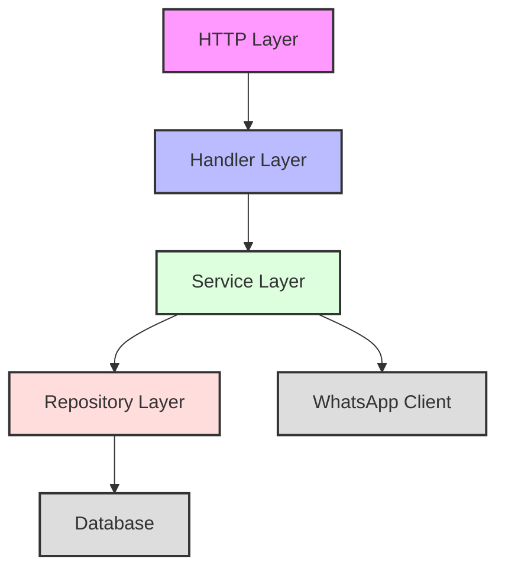
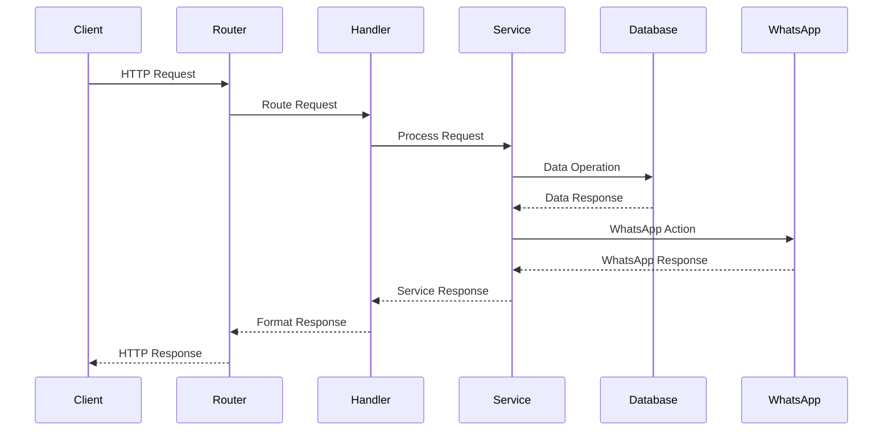
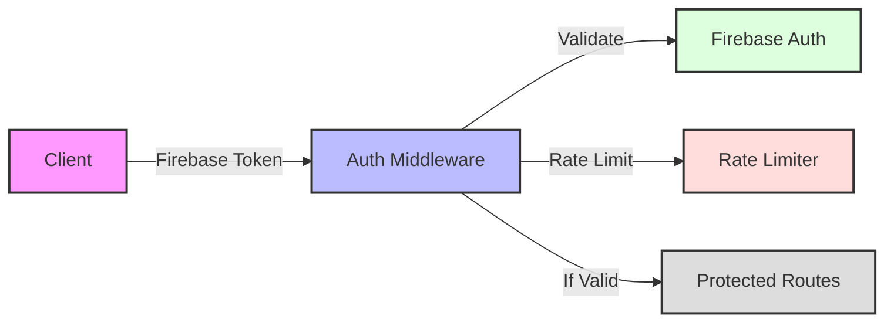
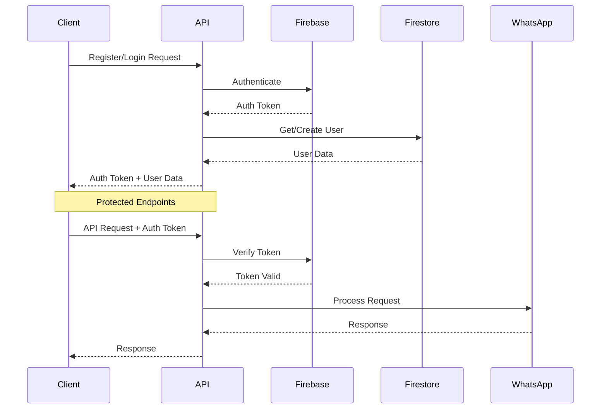
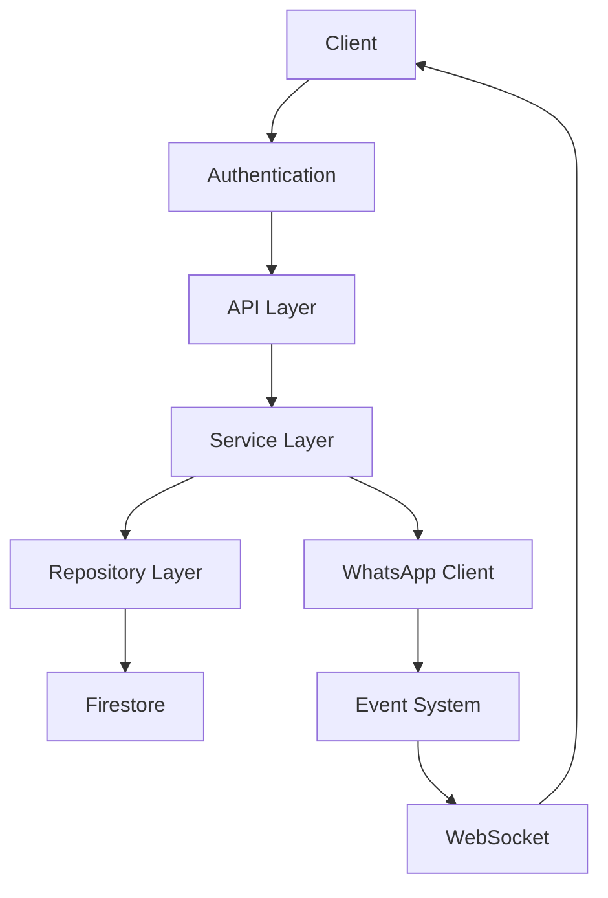

# 🏗️ GoWAG Architecture

## 📋 Overview

GoWAG (Go WhatsApp Gateway) is designed with a clean, modular architecture following domain-driven design principles and clean architecture patterns.

## 🎯 Design Goals

- **Modularity**: Easy to extend and maintain
- **Scalability**: Handles high message volumes
- **Reliability**: Ensures message delivery
- **Security**: Robust authentication and authorization
- **Observability**: Comprehensive logging and monitoring

## 🏛️ Architecture Layers



### 1. HTTP Layer (Router)
- Handles HTTP requests and routing
- Implements middleware (auth, rate limiting)
- Request/response transformation

### 2. Handler Layer
- Request validation
- Response formatting
- Error handling
- Maps HTTP requests to service calls

### 3. Service Layer
- Business logic implementation
- Transaction management
- Event handling
- External service integration

### 4. Repository Layer
- Data access abstraction
- CRUD operations
- Query optimization
- Cache management

## 🔄 Data Flow



## 📦 Core Components

### 1. WhatsApp Service
- Manages WhatsApp connection
- Handles message sending/receiving
- QR code generation
- Session management

### 2. Message Service
- Message queue management
- Retry mechanisms
- Message history
- Media handling

### 3. Auto-Reply Service
- Rule processing
- Pattern matching
- Response generation
- Schedule management

### 4. Webhook Service
- Event dispatching
- Retry mechanism
- Payload formatting
- Error handling

## 🔐 Security Architecture



### Security Features
- Firebase Authentication
- Rate Limiting
- Input Validation
- HTTPS Enforcement
- Webhook Signatures
- Session Security

## 📊 Monitoring & Observability

### Metrics Collected
- Message Throughput
- Response Times
- Error Rates
- Queue Lengths
- Connection Status

### Monitoring Tools
- Prometheus
- Grafana Dashboards
- Application Logs
- Error Tracking

## 🔄 Scalability & High Availability

### Horizontal Scaling
- Stateless Services
- Load Balancing
- Session Distribution
- Database Sharding

### Reliability Features
- Circuit Breakers
- Retry Mechanisms
- Dead Letter Queues
- Failover Handling

## 🛠️ Development Practices

### Code Organization
```
GoWAG/
├── cmd/           # Application entry points
├── configs/       # Configuration files
├── internal/      # Private application code
│   ├── auth/      # Authentication
│   ├── handler/   # HTTP handlers
│   ├── repository/# Data access
│   ├── routes/    # Route definitions
│   └── service/   # Business logic
├── pkg/           # Public libraries
│   ├── models/    # Data models
│   └── utils/     # Utilities
└── scripts/       # Maintenance scripts
```

### Best Practices
- Dependency Injection
- Interface-Based Design
- Comprehensive Testing
- Error Handling
- Documentation
- Code Reviews

## 📐 System Architecture

### Repository Pattern

#### Firestore Repository
The application uses a flexible repository pattern for Firestore interactions:

```go
type Repository interface {
    // Common repository methods
    GetClient() *firestore.Client
    // Other CRUD methods
}
```

#### Key Architectural Components
- **Abstraction**: Repository interface allows easy swapping of database implementations
- **Dependency Injection**: Repositories are passed through configuration
- **Type Safety**: Strict type checking for repository initialization

### Router Configuration

#### Dependency Injection
The router uses a comprehensive configuration approach:

```go
type RouterConfig struct {
    Logger        *utils.Logger
    FirestoreRepo repository.Repository  // Flexible repository injection
    WAService     *service.WAService
    Services      *Services
    Auth          *AuthMiddleware
}
```

#### Client Initialization Safeguards
- Type assertion to ensure correct repository type
- Explicit nil checks for Firestore client
- Detailed logging for configuration errors

### Error Handling Principles
- Fail fast on critical configuration errors
- Provide detailed logging
- Use panic for unrecoverable configuration issues

## 🔒 Security Considerations
- Repository type validation
- Explicit client initialization checks
- Logging of configuration and initialization steps

## 🚀 Scalability Features
- Modular design allows easy extension
- Dependency injection supports multiple repository implementations
- Centralized configuration management

## 🛠️ Dependency Management
- Explicit dependency injection
- Clear separation of concerns
- Minimal coupling between components

## 🩺 Health Monitoring and System Observability

### Health Check Architecture

#### Design Principles
- Conditional information gathering
- Minimal information exposure
- Secure and role-based access

#### Health Check Types
1. **Public Health Check**
   - Basic service availability
   - Minimal system information
   - No sensitive details

2. **Readiness Check**
   - Dependency status
   - Service component readiness
   - Dynamic service state reporting

3. **Admin Health Check**
   - Comprehensive system details
   - Optional system information
   - Configurable information exposure

### System Information Handling

#### Conditional Information Capture
```go
// Capture system details only if information is available
systemDetails := &SystemHealthDetails{}
if goVersion := runtime.Version(); goVersion != "" {
    systemDetails.GoVersion = goVersion
}
```

#### Key Monitoring Features
- Runtime environment detection
- Service dependency tracking
- Optional system metrics

### Security Considerations
- Filter sensitive configuration
- Role-based health check access
- Prevent information disclosure

### Observability Best Practices
- Use structured logging
- Implement comprehensive monitoring
- Design for minimal performance overhead 

## 🔄 System Overview

GoWAG (Go WhatsApp Gateway) is a robust WhatsApp messaging gateway built with Go. The system follows a clean architecture pattern with clear separation of concerns.

## 📦 Core Components

### 1. Authentication Layer
- Firebase Authentication integration
- Role-based access control (RBAC)
- Token management and validation
- Rate limiting middleware
- Session management
- Development bypass mode

### 2. API Layer
- RESTful endpoints
- WebSocket connections
- Webhook handlers
- Health monitoring
- Input validation
- Error handling

### 3. Business Logic Layer
- Message processing
- Auto-reply system
- Webhook management
- User management
- Session management
- Scheduling system

### 4. Data Layer
- Firestore database
- Repository pattern
- Data models
- Cache management

### 5. WhatsApp Integration
- Multi-session support
- Message handling
- Media processing
- QR code generation
- Status updates

## 🔄 Authentication Flow



## 📄 Directory Structure

```
GoWAG/
├── cmd/                 # Application entry points
├── configs/            # Configuration files
├── internal/           # Private application code
│   ├── auth/          # Authentication middleware
│   ├── handler/       # HTTP handlers
│   ├── repository/    # Data access layer
│   ├── routes/        # Route definitions
│   └── service/       # Business logic
├── pkg/               # Public libraries
│   ├── events/        # Event handling
│   ├── models/        # Data models
│   ├── utils/         # Utilities
│   └── websocket/     # WebSocket handling
└── web/               # Web interface
```

## 🔐 Security Architecture

### 🔑 Authentication
1. Firebase Authentication
   - Email/Password
   - Google Sign-In
   - Custom tokens
   - Token verification
   - Role management

2. Rate Limiting
   - Per-user limits
   - Global limits
   - Configurable thresholds

3. Session Management
   - Token-based
   - Refresh mechanism
   - Session invalidation

### 🔒 Authorization
1. Role-Based Access Control
   - User roles
   - Admin roles
   - Custom claims

2. Resource Access
   - User-specific resources
   - Admin-only endpoints
   - Public endpoints

## 🔄 Data Flow



## 🛠️ Development Environment

1. Local Setup
   - Development configuration
   - Auth bypass mode
   - Mock services

2. Testing
   - Unit tests
   - Integration tests
   - Mock data

## 🚀 Deployment Architecture

1. Container-based
   - Docker support
   - Docker Compose
   - Health checks

2. Monitoring
   - Prometheus metrics
   - Logging system
   - Error tracking

## 🎯 Best Practices

1. Code Organization
   - Clean architecture
   - Dependency injection
   - Interface-based design

2. Error Handling
   - Structured errors
   - Error logging
   - Client feedback

3. Security
   - HTTPS everywhere
   - Token validation
   - Input sanitization

4. Performance
   - Connection pooling
   - Caching
   - Rate limiting

## 🔄 Future Considerations

1. Scalability
   - Horizontal scaling
   - Load balancing
   - Session distribution

2. Features
   - Additional auth providers
   - Enhanced monitoring
   - Advanced analytics

3. Integration
   - Additional messaging platforms
   - External service integration
   - API versioning 